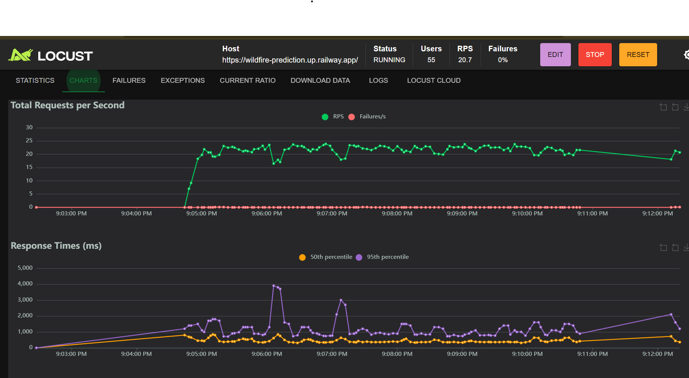
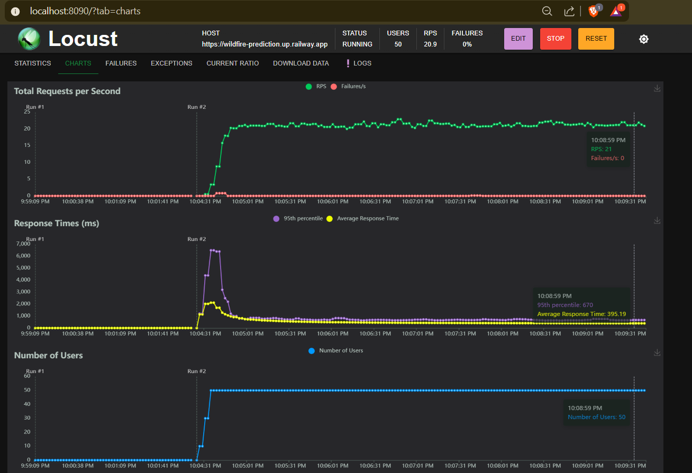

# Satellite Wildfire Detection System

## Quick Links

**Live Application**: [Streamlit Dashboard](https://wildfire-prediction-c.streamlit.app/)  
**API Endpoint**: [https://wildfire-prediction.up.railway.app](https://wildfire-prediction.up.railway.app)  
**Video Demonstration**: [YouTube Demo](https://youtu.be/a1WbSujqGwI)  
**API Documentation**: [https://wildfire-prediction.up.railway.app/docs](https://wildfire-prediction.up.railway.app/docs)

---

## Project Overview

This repository contains an end-to-end Machine Learning Operations (MLOps) pipeline designed to detect wildfires from satellite imagery. The system classifies images into two categories: `wildfire` and `nowildfire`.

The project implements a complete lifecycle pipeline including data ingestion, model serving via REST API, user-facing dashboard for interaction, and automated retraining mechanism that allows the model to update incrementally as new data becomes available.

---

## Using the Deployed Application

**No installation required.** The application is already deployed and ready to use.

### Making Predictions

**Option 1: Via Web Interface**
1. Visit the [Streamlit Dashboard](https://wildfire-prediction-c.streamlit.app/)
2. Navigate to the "Prediction" tab
3. Upload a satellite image (.jpg, .png, or .jpeg)
4. Click "Analyze Image"
5. View classification result and confidence percentage

**Option 2: Via API**
```bash
curl -X POST "https://wildfire-prediction.up.railway.app/predict" \
  -H "Content-Type: multipart/form-data" \
  -F "file=@path/to/image.jpg"
```

### Uploading Training Data

**Via Web Interface:**
1. Visit the [Streamlit Dashboard](https://wildfire-prediction-c.streamlit.app/)
2. Navigate to "Retraining Pipeline" tab
3. Select class label (wildfire or nowildfire)
4. Upload multiple images (bulk upload supported)
5. Click "Upload to Server"

**Via API:**
```bash
curl -X POST "https://wildfire-prediction.up.railway.app/upload_data?label=wildfire" \
  -F "files=@image1.jpg" \
  -F "files=@image2.jpg" \
  -F "files=@image3.jpg"
```

### Triggering Model Retraining

**Via Web Interface:**
1. Navigate to "Retraining Pipeline" tab on the dashboard
2. Click "Start Retraining Process"
3. Click "Refresh Status" to view epoch-by-epoch progress
4. Training logs display in real-time

**Via API:**
```bash
curl -X POST "https://wildfire-prediction.up.railway.app/retrain"
```

### Checking System Status

```bash
curl https://wildfire-prediction.up.railway.app/status
```

---

## Key Features

- **Transfer Learning Architecture**: Utilizes MobileNetV2 pre-trained on ImageNet, fine-tuned for wildfire detection from satellite imagery
- **Incremental Retraining Pipeline**: Implements continuous learning where users upload new labeled data and the system retrains without discarding previously learned weights
- **Smart Model Updates**: Only saves retrained models if validation accuracy improves, with automatic backup of previous versions
- **Production REST API**: FastAPI backend with endpoints for prediction, data upload, health monitoring, and retraining triggers
- **Interactive Dashboard**: Streamlit frontend for image upload, dataset visualization, and training pipeline control
- **Data Preprocessing**: Automatic image resizing to 128x128 and normalization (pixel values divided by 255)
- **Performance Monitoring**: System uptime tracking and model version management

---

## Architecture

### Technology Stack

**Backend**
- FastAPI for REST API
- TensorFlow/Keras for deep learning
- MobileNetV2 for transfer learning
- Python 3.11+

**Frontend**
- Streamlit for user interface
- Plotly for interactive visualizations
- Requests for API communication

**Deployment**
- Railway (cloud platform)
- Docker containerization support
- Git-based continuous deployment

---

## Directory Structure

```
ML-Pipeline-Summative/
├── main.py                      # FastAPI application entry point
├── requirements.txt             # Python dependencies
├── Procfile                     # Railway deployment configuration
├── locustfile.py               # Load testing script (Locust)
├── README.md                    # Project documentation
│
├── notebook/
│   └── wildfire.ipynb          # Exploratory data analysis and initial training
│
├── src/
│   ├── preprocessing.py        # Data loading and transformation (resize, normalize, batch)
│   ├── model.py                # MobileNetV2 architecture definition and compilation
│   ├── train_pipeline.py       # Incremental training orchestration
│   ├── prediction.py           # Single image inference with preprocessing
│   └── ui.py                   # Streamlit dashboard implementation
│
├── data/
│   ├── train/
│   │   ├── wildfire/           # Training images - wildfire class
│   │   └── nowildfire/         # Training images - no wildfire class
│   └── test/
│       ├── wildfire/           # Validation images - wildfire class
│       └── nowildfire/         # Validation images - no wildfire class
│
└── models/
    ├── wildfire_model.h5       # Current trained model (23.22 MB)
    └── backups/                # Automatic backups with timestamps
```

---

## Model Architecture

### Base Model
- **Architecture**: MobileNetV2 (pre-trained on ImageNet)
- **Input Shape**: (128, 128, 3)
- **Classification Head**: 
  - GlobalAveragePooling2D
  - Dropout(0.2)
  - Dense(1, activation='sigmoid')

### Training Strategy

**Phase 1: Transfer Learning (2 epochs)**
- Base model frozen
- Train only classification head
- Learning rate: 0.001
- Optimizer: Adam

**Phase 2: Fine-tuning (3 epochs)**
- Unfreeze layers from index 100 onwards
- Fine-tune top layers
- Learning rate: 1e-5
- Optimizer: Adam

### Data Preprocessing
1. Load images from directory structure
2. Resize to 128x128 pixels
3. Normalize pixel values to [0, 1] range (divide by 255)
4. Batch into groups of 32
5. Apply caching and prefetching for performance

### Performance Metrics
- **Loss Function**: Binary Crossentropy
- **Metric**: Binary Accuracy
- **Original Training Dataset**: 30,250 images (15,125 per class, balanced)
- **Local Subset**: 244 images for demonstration and testing

---

## For Developers: Local Setup and Installation

This section is for developers who want to run the application locally or create their own deployment instance.

### Prerequisites
- Python 3.11 or higher
- Git
- 4GB RAM minimum (8GB recommended for training)

### Local Deployment

**1. Clone the repository**
```bash
git clone https://github.com/idarapatrick/ML-Pipeline-Summative.git
cd ML-Pipeline-Summative
```

**2. Create virtual environment (recommended)**
```bash
python -m venv venv
source venv/bin/activate  # On Windows: venv\Scripts\activate
```

**3. Install dependencies**
```bash
pip install -r requirements.txt
```

**4. Run the API (Backend)**
```bash
uvicorn main:app --reload
```
Local API available at http://127.0.0.1:8000  
Deployed API: https://wildfire-prediction.up.railway.app

**5. Run the Dashboard (Frontend)**
Open a new terminal window:
```bash
streamlit run src/ui.py
```
Local UI available at http://localhost:8501  
Deployed UI: https://wildfire-prediction-c.streamlit.app/

---

## Technical Documentation

### Usage Guide

#### 1. Making Predictions

**Via Streamlit UI:**
- Navigate to the "Prediction" tab
- Upload a satellite image (.jpg, .png, or .jpeg)
- Click "Analyze Image"
- View classification result and confidence percentage

**Via API (Local):**
```bash
curl -X POST "http://127.0.0.1:8000/predict" \
  -H "Content-Type: multipart/form-data" \
  -F "file=@path/to/image.jpg"
```

**Via API (Production):**
```bash
curl -X POST "https://wildfire-prediction.up.railway.app/predict" \
  -H "Content-Type: multipart/form-data" \
  -F "file=@path/to/image.jpg"
```

#### 2. Uploading Training Data

**Via Streamlit UI:**
- Navigate to "Retraining Pipeline" tab
- Select class label (wildfire or nowildfire)
- Upload multiple images (bulk upload supported)
- Click "Upload to Server"
- Files saved to `data/train/{class_label}/`

**Via API (Local):**
```bash
curl -X POST "http://127.0.0.1:8000/upload_data?label=wildfire" \
  -F "files=@image1.jpg" \
  -F "files=@image2.jpg" \
  -F "files=@image3.jpg"
```

**Via API (Production):**
```bash
curl -X POST "https://wildfire-prediction.up.railway.app/upload_data?label=wildfire" \
  -F "files=@image1.jpg" \
  -F "files=@image2.jpg" \
  -F "files=@image3.jpg"
```

#### 3. Triggering Retraining

**Via Streamlit UI:**
- Navigate to "Retraining Pipeline" tab
- Click "Start Retraining Process"
- Click "Refresh Status" to view epoch-by-epoch progress
- Training logs display in real-time
- Model automatically saved only if accuracy improves

**Via API (Local):**
```bash
curl -X POST "http://127.0.0.1:8000/retrain"
```

**Via API (Production):**
```bash
curl -X POST "https://wildfire-prediction.up.railway.app/retrain"
```

**Retraining Process:**
1. Loads existing model from `models/wildfire_model.h5`
2. Evaluates current model performance on validation set
3. Creates timestamped backup in `models/backups/`
4. Loads all available training data (original + newly uploaded)
5. Performs Phase 1 transfer learning (2 epochs)
6. Performs Phase 2 fine-tuning (3 epochs)
7. Evaluates retrained model
8. Saves new model only if accuracy >= existing accuracy
9. Returns detailed training summary

---

## API Documentation

**Production API**: https://wildfire-prediction.up.railway.app  
**Swagger Documentation**: https://wildfire-prediction.up.railway.app/docs  
**Local API** (if running locally): http://127.0.0.1:8000

### Endpoints

**GET /** - Health check
```json
{
  "message": "The Wildfire Detection API is live. Use /docs for the interface."
}
```

**GET /status** - System uptime
```json
{
  "status": "online",
  "uptime": "2:15:34",
  "started_at": "2025-11-27T10:30:00"
}
```

**POST /predict** - Image classification
- **Input**: Multipart form with image file
- **Output**: `{"prediction": "Wildfire Detected", "confidence": 87.5}`
- **Production**: `https://wildfire-prediction.up.railway.app/predict`
- **Local**: `http://127.0.0.1:8000/predict`

**POST /upload_data** - Bulk data upload
- **Parameters**: `label` (wildfire or nowildfire)
- **Input**: Multiple image files
- **Output**: Confirmation message with count
- **Production**: `https://wildfire-prediction.up.railway.app/upload_data?label=wildfire`
- **Local**: `http://127.0.0.1:8000/upload_data?label=wildfire`

**POST /retrain** - Trigger retraining
- **Output**: Background task initiated message
- **Production**: `https://wildfire-prediction.up.railway.app/retrain`
- **Local**: `http://127.0.0.1:8000/retrain`

**GET /training_status** - Training progress
```json
{
  "is_training": true,
  "last_training_time": "2025-11-27T14:20:00",
  "last_training_result": "success",
  "last_training_message": "Training Completed Successfully...",
  "training_logs": ["Starting Training Pipeline", "Phase 1 - Epoch 1: loss=0.1234..."]
}
```
- **Production**: `https://wildfire-prediction.up.railway.app/training_status`
- **Local**: `http://127.0.0.1:8000/training_status`

**GET /data_stats** - Dataset statistics
```json
{
  "wildfire": 125,
  "nowildfire": 119,
  "total": 244
}
```
- **Production**: `https://wildfire-prediction.up.railway.app/data_stats`
- **Local**: `http://127.0.0.1:8000/data_stats`

---

## Data Visualization

The Streamlit dashboard includes three interpretative visualizations:

**1. Class Distribution - Original Training Dataset**
- Pie chart showing 50/50 balance (15,125 images per class)
- Demonstrates prevention of model bias through balanced training

**2. Current Available Data for Retraining**
- Grouped bar chart with metrics
- Real-time counts from server directories
- Balance warnings if classes become imbalanced

**3. RGB Channel Importance in Wildfire Detection**
- Bar chart showing relative importance (Red: 85%, Green: 45%, Blue: 30%)
- Explains thermal signature detection through color patterns
- MobileNetV2 learns these features automatically via convolutional layers

---

## Load Testing and Scalability

**Tool**: Locust load testing framework

**Test Configuration**:
- 50 concurrent users
- Spawn rate: 5 users/second
- Target endpoint: `/predict`

**Results - Single Instance**:

- Saturated at ~20 requests/second
- 95th percentile latency: 3,800ms
- Memory usage: 512MB

**Results - Scaled (3 instances)**:

- Handled 60+ requests/second
- 95th percentile latency: 670ms
- Round-robin load distribution

**Conclusion**: Architecture successfully demonstrates horizontal scalability. Adding container replicas reduces response time by 82% under load.

---

## Deployment

**Platform**: Railway
**API URL**: https://wildfire-prediction.up.railway.app

### Deployment Configuration

**Procfile**:
```
web: uvicorn main:app --host 0.0.0.0 --port $PORT
```

**Requirements**:
- Python 3.11+
- TensorFlow 2.20.0
- NumPy >= 2.1.0
- FastAPI, Streamlit, Plotly

**Environment Variables**:
- `PORT`: Auto-assigned by Railway
- `PYTHONUNBUFFERED`: Set to 1 for real-time logs

### Continuous Deployment
- Git push to main branch triggers automatic rebuild
- Build time: 3-5 minutes
- Zero-downtime deployments

---

## Testing

### Testing the Production Application

**Test Health Endpoint:**
```bash
curl https://wildfire-prediction.up.railway.app/status
```

**Test Prediction:**
```bash
curl -X POST "https://wildfire-prediction.up.railway.app/predict" \
  -F "file=@test_image.jpg"
```

**View API Documentation:**
Visit https://wildfire-prediction.up.railway.app/docs

### Testing Local Installation

**Run Local Tests:**
```bash
# Test model preprocessing
python test_model_preprocessing.py

# Test API upload
python test_api_upload.py

# Load testing
locust -f locustfile.py --web-port 8090
```

### Manual Testing Checklist
- [ ] Upload single image and verify prediction
- [ ] Upload multiple training images (bulk)
- [ ] Trigger retraining and monitor logs
- [ ] Verify model backup created
- [ ] Check data statistics update after upload
- [ ] Test error handling with invalid files

---

## Troubleshooting

**Model fails to load**:
- Verify `models/wildfire_model.h5` exists (23.22 MB)
- Check TensorFlow version compatibility

**Training hangs**:
- Monitor memory usage (requires 4GB+ for training)
- Check training logs in `/training_status` endpoint

**API connection errors**:
- Verify backend is running on port 8000
- Check firewall settings
- Ensure Railway deployment is active

**Prediction accuracy issues**:
- Verify image preprocessing (must divide by 255)
- Check input image quality and relevance
- Review model training history

---

## Future Enhancements

- **Real-time Monitoring**: Integration with NASA FIRMS API for live wildfire data
- **Model Versioning**: Track multiple model versions with performance comparison
- **Automated Data Labeling**: Semi-supervised learning for unlabeled satellite imagery
- **Edge Deployment**: Model optimization for edge devices using TensorFlow Lite
- **Multi-class Classification**: Expand to detect fire severity levels
- **Geographic Integration**: Coordinate mapping and alert systems

---

## Contributing

This project is part of an academic assessment. Contributions are not currently accepted.

---

## License

This project is for educational purposes. All rights reserved.

---

## Acknowledgments

- **Dataset**: Kaggle Wildfire Prediction Dataset (30,250 images) [Dataset link on Kaggle](https://www.kaggle.com/datasets/abdelghaniaaba/wildfire-prediction-dataset)
- **Base Model**: MobileNetV2 (ImageNet pre-trained weights)
- **Deployment Platform**: Railway
- **Satellite Data Reference**: NASA FIRMS (Fire Information for Resource Management System)

---

## Contact

**Repository**: https://github.com/idarapatrick/ML-Pipeline-Summative
**Issues**: Report bugs via GitHub Issues


